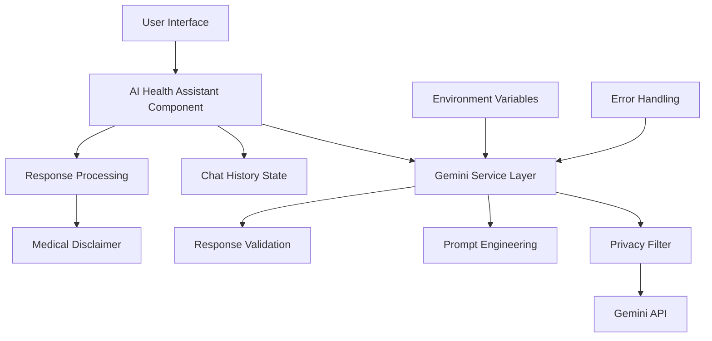

# AI Integration Guide - HealSync v3

## 📚 Table of Contents
1. [Overview](#overview)
2. [Architecture](#architecture)
3. [Gemini API Setup](#gemini-api-setup)
4. [AI Health Assistant](#ai-health-assistant)
5. [Implementation Details](#implementation-details)
6. [Security & Privacy](#security--privacy)
7. [Usage Examples](#usage-examples)
8. [Future Enhancements](#future-enhancements)
9. [Troubleshooting](#troubleshooting)

---

## 📋 Overview

The AI integration in HealSync leverages Google's Gemini API to provide intelligent health assistance, making healthcare information more accessible and user-friendly. The system maintains strict privacy standards while offering valuable health insights.

### Key Features Implemented
- ✅ **AI Health Assistant**: 24/7 conversational health support
- ✅ **Medical Term Explanations**: Simplify complex medical terminology
- ✅ **General Health Guidance**: Evidence-based health information
- ✅ **Symptom Understanding**: Help users understand their symptoms better
- ✅ **Privacy-First Design**: No personal medical data sent to AI

### Future Features Planned
- 🔄 **Medical Record Summarization**: AI-generated health summaries
- 🔄 **Personalized Health Recommendations**: Tailored health advice
- 🔄 **Smart Medical Search**: Natural language search through records
- 🔄 **Risk Assessment**: Proactive health risk identification

---

## 🏗️ Architecture



### File Structure
```
src/
├── services/
│   ├── geminiService.js          # Core Gemini API integration
│   └── aiHealthAssistant.js      # Health-specific AI logic
├── components/
│   ├── AIHealthAssistant.jsx     # Main chat interface
│   ├── ChatMessage.jsx           # Individual message component
│   └── TypingIndicator.jsx       # Loading animation
├── utils/
│   ├── privacyFilter.js          # Data sanitization
│   └── medicalPrompts.js         # Prompt templates
└── config/
    └── aiConfig.js               # AI configuration
```

---

## 🔑 Gemini API Setup

### 1. Get Your API Key
1. Visit [Google AI Studio](https://aistudio.google.com/)
2. Sign in with your Google account
3. Click "Create API Key" 
4. Copy your API key

### 2. Environment Variables
Create a `.env` file in your project root (copy from `.env.example`):
```bash
# AI Configuration - Gemini API
VITE_GEMINI_API_KEY=your_actual_api_key_here
VITE_AI_MODEL_NAME=gemini-1.5-flash
VITE_AI_ENABLED=true
```

**Important**: Never commit your `.env` file to git. It's already in `.gitignore`.

### 3. Installation
The required package is already installed:
```bash
npm install @google/generative-ai
```

### 4. Test the Integration
1. Start the development server: `npm run dev`
2. Open your browser to the local URL
3. Navigate to the user or doctor dashboard
4. Click the AI Health Assistant button
5. Try asking: "What is high blood pressure?"

---

## 🤖 AI Health Assistant

### Core Functionality

#### 1. **Conversational Interface**
- Natural language processing for health questions
- Context-aware responses based on conversation history
- Multi-turn conversations with memory

#### 2. **Health-Focused Prompting**
```javascript
const healthSystemPrompt = `
You are a helpful health information assistant for HealSync, a medical records platform.

IMPORTANT GUIDELINES:
- Provide general health information only
- Always recommend consulting healthcare professionals
- Never provide specific medical diagnoses
- Be empathetic and supportive
- Use simple, easy-to-understand language
- Include relevant medical disclaimers
`;
```

#### 3. **Privacy Protection**
- No personal medical data sent to external APIs
- Generic health information responses only
- Local data processing where possible
- User consent for AI features

### Response Categories

#### ✅ **What the AI CAN help with:**
- General health information and education
- Explanation of medical terms and procedures
- Lifestyle and wellness tips
- Understanding symptoms (general information)
- Medication information (general)
- Health prevention strategies

#### ❌ **What the AI CANNOT do:**
- Provide specific medical diagnoses
- Replace professional medical advice
- Access or analyze personal medical records
- Prescribe medications or treatments
- Handle medical emergencies

---

## 💻 Implementation Details

### 1. Gemini Service (`geminiService.js`)
```javascript
import { GoogleGenerativeAI } from '@google/generative-ai';

class GeminiService {
  constructor() {
    this.apiKey = import.meta.env.VITE_GEMINI_API_KEY;
    this.modelName = import.meta.env.VITE_AI_MODEL_NAME || 'gemini-1.5-flash';
    this.genAI = new GoogleGenerativeAI(this.apiKey);
    this.model = this.genAI.getGenerativeModel({ model: this.modelName });
  }

  async generateResponse(prompt, context = []) {
    // Implementation with error handling and retry logic
  }
}
```

### 2. Health Assistant Component (`AIHealthAssistant.jsx`)
- **React Hooks**: useState, useEffect, useRef for state management
- **Real-time Updates**: Streaming responses for better UX
- **Accessibility**: ARIA labels and keyboard navigation
- **Responsive Design**: Mobile-first responsive layout

### 3. Privacy Filter (`privacyFilter.js`)
```javascript
export function sanitizeInput(userInput) {
  // Remove potential personal identifiers
  // Filter sensitive medical information
  // Ensure generic health queries only
}
```

---

## 🔒 Security & Privacy

### Data Protection Principles
1. **Minimal Data Transfer**: Only generic queries sent to AI
2. **No Personal Information**: Names, dates, specific records excluded
3. **Local Processing**: Sensitive operations happen client-side
4. **User Consent**: Clear opt-in for AI features
5. **Transparency**: Users know when AI is being used

### HIPAA Compliance Considerations
- **No PHI to External APIs**: Personal Health Information stays local
- **Audit Trails**: Log AI interactions (without content)
- **Access Controls**: AI features respect user permissions
- **Data Retention**: No conversation storage on external servers

### Security Measures
- **API Key Protection**: Environment variables only
- **Input Validation**: Sanitize all user inputs
- **Rate Limiting**: Prevent API abuse
- **Error Handling**: Graceful failures with fallbacks

---

## 🎯 Usage Examples

### Example 1: General Health Question
```
User: "What is high blood pressure?"

AI Response: "High blood pressure (hypertension) occurs when the force of blood against your artery walls is consistently too high. This can strain your heart and blood vessels over time.

Normal blood pressure is typically below 120/80 mmHg. High blood pressure is generally 130/80 mmHg or higher.

Common factors include:
- Diet high in sodium
- Lack of physical activity
- Stress
- Family history

⚕️ Medical Disclaimer: This is general information only. Please consult your healthcare provider for personalized advice and proper blood pressure management."
```

### Example 2: Symptom Understanding
```
User: "I have a headache and feel tired. What could this mean?"

AI Response: "Headaches combined with fatigue can have many common causes:

• Dehydration - Very common and easily treatable
• Lack of sleep or poor sleep quality
• Stress or tension
• Skipping meals or low blood sugar
• Eye strain from screens
• Caffeine withdrawal

Simple steps to try:
- Drink water and rest
- Ensure adequate sleep
- Eat regular, balanced meals
- Take breaks from screens

⚠️ Important: If symptoms persist, worsen, or you experience severe headache, fever, vision changes, or other concerning symptoms, please seek medical attention promptly."
```

---

## 🚀 Future Enhancements

### Phase 2: Advanced Features
1. **Medical Record Summarization**
   - AI-generated health timeline summaries
   - Key insights from medical history
   - Trend identification

2. **Personalized Recommendations**
   - Lifestyle suggestions based on conditions
   - Preventive care reminders
   - Medication adherence support

3. **Smart Search**
   - Natural language queries: "When was my last blood test?"
   - Semantic search through medical records
   - Quick information retrieval

### Phase 3: Predictive Analytics
1. **Risk Assessment**
   - Early warning systems
   - Preventive care recommendations
   - Health trend predictions

2. **Treatment Insights**
   - Outcome predictions
   - Alternative treatment suggestions
   - Evidence-based recommendations

---

## 🛠️ Troubleshooting

### Common Issues

#### 1. API Key Problems
```
Error: "API key not configured"
Solution: Check .env file and restart development server
```

#### 2. Rate Limiting
```
Error: "Too many requests"
Solution: Implement request queuing or upgrade API plan
```

#### 3. Model Availability
```
Error: "Model not found"
Solution: Check model name in configuration
```

### Debugging Tips
1. **Console Logging**: Enable debug mode for detailed logs
2. **Network Tab**: Check API request/response in browser
3. **Error Boundaries**: Implement React error boundaries
4. **Fallback UI**: Always provide non-AI alternatives

### Performance Optimization
1. **Response Caching**: Cache common health questions
2. **Lazy Loading**: Load AI components on demand
3. **Debouncing**: Prevent excessive API calls
4. **Streaming**: Use streaming responses for better UX

---

## 📊 Monitoring & Analytics

### Key Metrics to Track
- **Usage Frequency**: How often users interact with AI
- **Response Quality**: User feedback on AI responses
- **Error Rates**: API failures and handling
- **Performance**: Response times and user experience

### Implementation
```javascript
// Analytics tracking (privacy-compliant)
function trackAIInteraction(action, metadata = {}) {
  // Track without sensitive content
  analytics.track('ai_health_assistant', {
    action,
    timestamp: Date.now(),
    ...metadata
  });
}
```

---

## 📝 Development Guidelines

### Code Quality
- **TypeScript**: Consider migration for better type safety
- **Testing**: Unit tests for AI service functions
- **Documentation**: JSDoc comments for all AI functions
- **Linting**: ESLint rules for consistent code style

### Best Practices
1. **Error Handling**: Always provide graceful fallbacks
2. **User Feedback**: Clear loading states and error messages
3. **Accessibility**: Screen reader friendly AI interactions
4. **Performance**: Optimize for mobile and slow connections

---

## 🎓 Learning Resources

### Gemini API Documentation
- [Google AI Studio](https://aistudio.google.com/)
- [Gemini API Docs](https://ai.google.dev/docs)
- [Best Practices Guide](https://ai.google.dev/docs/best_practices)

### Healthcare AI Ethics
- [WHO Ethics Guidelines](https://www.who.int/publications/i/item/9789240029200)
- [FDA AI/ML Guidelines](https://www.fda.gov/medical-devices/software-medical-device-samd/artificial-intelligence-and-machine-learning-aiml-enabled-medical-devices)
- [Healthcare Privacy Laws](https://www.hhs.gov/hipaa/index.html)

---

*This guide will be updated as new AI features are added to HealSync. Last updated: August 24, 2025*
