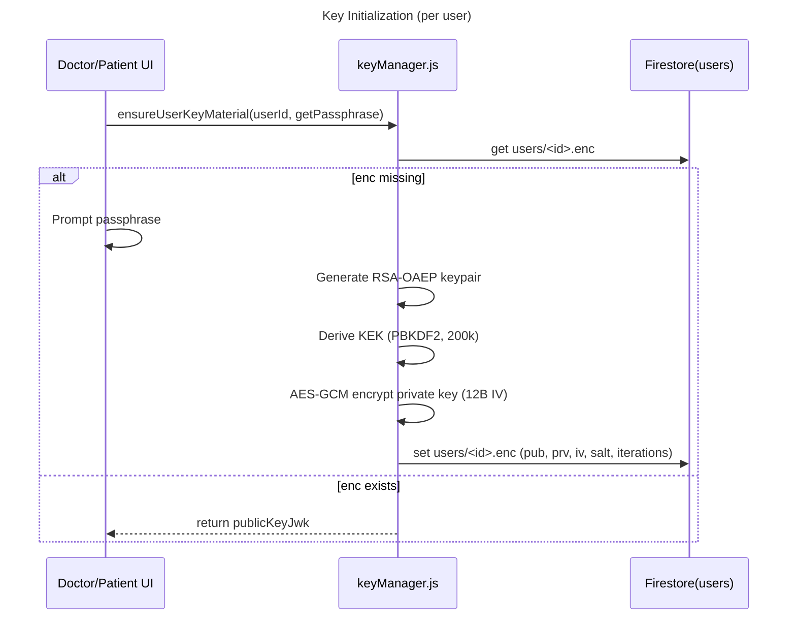
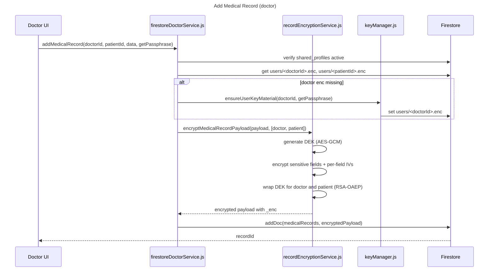
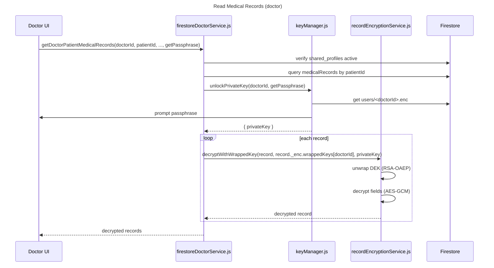
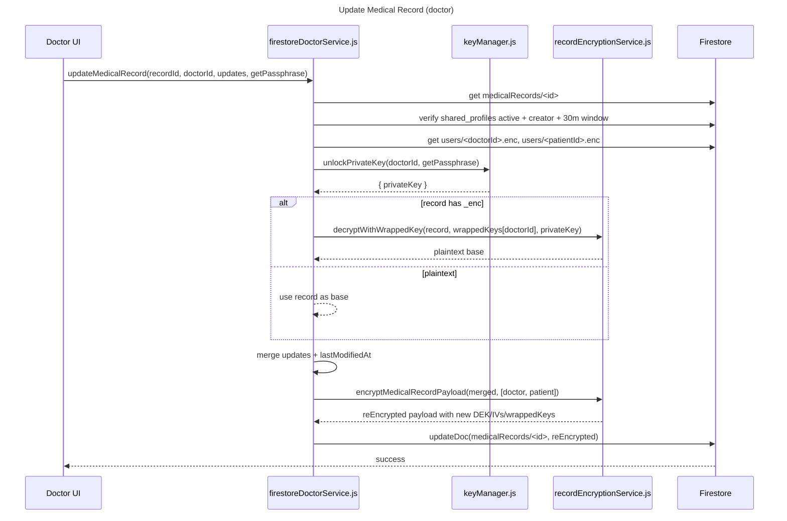

# Encryption Implementation Guide

Version: 1.0
Date: 2025-10-28

This document explains how end-to-end encryption for medical records works in HealSync. It covers the architecture, key management, encryption at rest and in transit, the data model, and how the UI participates (passphrase prompts). It also outlines limitations, security considerations, and operational guidance.

---

## High-level Overview

- Each user (doctor or patient) has an RSA-OAEP keypair. The public key (JWK) is stored in Firestore; the private key is encrypted with a key-encryption-key (KEK) derived from a passphrase and stored in Firestore as a ciphertext blob. The passphrase is never stored.
- Each medical record uses a fresh, random AES-GCM 256-bit Data Encryption Key (DEK). Sensitive fields within the record are encrypted with this DEK. The DEK is separately wrapped (encrypted) for each authorized reader (doctor and patient) using their RSA-OAEP public keys.
- On read, the current user unlocks their private key using their passphrase, unwraps the DEK for a record, and decrypts sensitive fields client-side.
- On update, the existing record is decrypted (if encrypted), a new DEK is generated, sensitive fields are re-encrypted, and DEK is re-wrapped for recipients.

---

## Components and Responsibilities

- `src/utils/webcrypto.js`
  - Thin wrapper on Web Crypto for:
    - RSA-OAEP key generation/import/export
    - AES-GCM key generation/import/export
    - AES-GCM encrypt/decrypt
    - PBKDF2-based KEK derivation from passphrases
    - Encoding helpers (base64, UTF-8) and random bytes
  - Algorithms:
    - RSA-OAEP-2048 with SHA-256 for key wrapping
    - AES-GCM-256 for data and private key encryption
    - PBKDF2 (SHA-256) with 200k iterations for KEK

- `src/utils/keyManager.js`
  - `ensureUserKeyMaterial(userId, getPassphrase)`
    - If user lacks `enc` material, prompts for a passphrase (via caller), generates RSA keypair, derives KEK, encrypts private key with AES-GCM, and persists under `users/<userId>.enc`.
    - Firestore `enc` schema:
      ```json
      {
        "pub": {"kty":"RSA", ...},
        "prv": "base64(AES-GCM-enc(PKCS8))",
        "iv": "base64(12B)",
        "kdfSalt": "base64(16B)",
        "kdfIterations": 200000,
        "alg": "RSA-OAEP-2048/SHA-256 + AES-GCM-256",
        "createdAt": 1730073600000
      }
      ```
  - `unlockPrivateKey(userId, getPassphrase)`
    - Prompts for passphrase, derives KEK using stored salt+iterations, decrypts PKCS8 private key, and returns `{ publicKey, privateKey }` CryptoKey handles.

- `src/utils/recordEncryptionService.js`
  - `SENSITIVE_FIELDS`:
    - `['diagnosis', 'symptoms', 'medicines', 'prescribedTests', 'followUpNotes']`
  - `encryptMedicalRecordPayload(payload, recipients)`
    - Generates random DEK (AES-GCM-256)
    - For each sensitive field present, encrypts JSON(value) with DEK and a fresh 12B IV
    - Wraps DEK with RSA-OAEP for each recipient `{ id, publicKey }`
    - Attaches an `_enc` object with algorithm info, per-field IVs, wrapped keys map, version
  - `decryptWithWrappedKey(encryptedPayload, wrappedKeyB64, privateKey)`
    - Unwraps DEK with the user’s private key
    - Decrypts each encrypted field using the matching IV
    - Returns a copy of the record with plaintext fields; leaves other fields as-is

- `src/utils/firestoreDoctorService.js`
  - `addMedicalRecord(doctorId, patientId, medicalData, getPassphrase)`
    - Verifies active share access, ensures doctor has `enc` material, validates patient `enc.pub`
    - Imports doctor+patient public keys and encrypts the record via `encryptMedicalRecordPayload`
    - Writes encrypted record to `medicalRecords`
  - `getDoctorPatientMedicalRecords(doctorId, patientId, lastDoc, pageSize, getPassphrase)`
    - Validates access; unlocks doctor’s private key via `unlockPrivateKey`
    - Decrypts each record using the doctor’s `wrappedKeys[doctorId]`
    - Returns records and simple pagination metadata
  - `updateMedicalRecord(recordId, doctorId, updateData, getPassphrase)`
    - Validates access and 30-minute edit window
    - Ensures doctor+patient `enc` materials exist; imports public keys
    - Decrypts existing record using doctor’s wrapped DEK (if encrypted)
    - Merges `updateData` into plaintext base, updates timestamps
    - Re-encrypts sensitive fields with a fresh DEK and re-wraps for both recipients

- UI participation
  - `src/pages/Doctor/PatientProfilePage.jsx`
    - Provides a cached per-session `getPassphrase` using `window.prompt`
    - Passes `getPassphrase` into service calls for reads, adds, and updates
    - UI guards for cases where decryption fails (e.g., rendering non-arrays)

---

## Encrypted Data Model

A medical record stored in Firestore after encryption looks like this (abridged):

```json
{
  "id": "<doc id>",
  "patientId": "user_patient_id",
  "doctorId": "user_doctor_id",
  "doctorIdCode": "DR-ABCD-1234",
  "doctorName": "Dr. Smith",
  "visitDate": "2025-10-20",

  "diagnosis": "base64(AES-GCM ciphertext)",
  "symptoms": "base64(AES-GCM ciphertext)",
  "medicines": "base64(AES-GCM ciphertext)",
  "prescribedTests": "base64(AES-GCM ciphertext)",
  "followUpNotes": "base64(AES-GCM ciphertext)",

  "_enc": {
    "alg": "AES-GCM-256 + RSA-OAEP-2048/SHA-256",
    "version": 1,
    "iv": {
      "diagnosis": "base64(12B)",
      "symptoms": "base64(12B)",
      "medicines": "base64(12B)",
      "prescribedTests": "base64(12B)",
      "followUpNotes": "base64(12B)"
    },
    "wrappedKeys": {
      "user_patient_id": "base64(RSA-OAEP(wrap(DEK)))",
      "user_doctor_id": "base64(RSA-OAEP(wrap(DEK)))"
    }
  },

  "createdAt": "serverTimestamp()",
  "lastModifiedAt": "serverTimestamp()",
  "createdBy": "user_doctor_id",
  "shareRecordId": "user_doctor_id_user_patient_id",
  "isActive": true
}
```

Notes:
- Non-sensitive fields (e.g., `visitDate`, `doctorName`, metadata) remain plaintext to enable querying and sorting without decryption.
- Sensitive fields are base64-encoded ciphertext strings.

---

## Flows

### 1) Key Initialization (per user)
1. UI calls `ensureUserKeyMaterial(userId, getPassphrase)`
2. If no `enc` material:
   - Prompt for passphrase
   - Generate RSA keypair (OAEP-2048 / SHA-256)
   - Derive KEK via PBKDF2(SHA-256, salt=16B, iterations=200k)
   - AES-GCM encrypt the private key with a random 12B IV
   - Persist `{pub, prv, iv, kdfSalt, kdfIterations, alg, createdAt}` in `users/<userId>.enc`

### 2) Add Medical Record
1. Verify `shared_profiles` grants access and is active
2. Ensure doctor has `enc` (call `ensureUserKeyMaterial` if missing)
3. Load doctor and patient `enc.pub`, import public keys
4. Build the record payload
5. `encryptMedicalRecordPayload(payload, [doctor, patient])` → returns encrypted record with `_enc`
6. Write to `medicalRecords`

### 3) Read Medical Records
1. Validate active sharing
2. Unlock doctor’s private key: `unlockPrivateKey(doctorId, getPassphrase)`
3. For each record:
   - Get `wrappedKeyB64 = record._enc.wrappedKeys[doctorId]`
   - `decryptWithWrappedKey(record, wrappedKeyB64, privateKey)`
4. Render decrypted fields; gracefully handle failures by showing placeholders

### 4) Update Medical Record
1. Validate access, creator match, and 30-minute window
2. Ensure enc materials for doctor+patient; import public keys
3. Decrypt the existing record using doctor’s wrapped DEK (if encrypted)
4. Merge `updateData` with plaintext base; update `lastModifiedAt`
5. Re-encrypt sensitive fields with a new DEK and wrap for both recipients
6. Update the Firestore document

## Sequence Diagrams









---

## Access Control vs Encryption

- Access control (share links, role checks) is enforced via Firestore documents (`shared_profiles`).
- Encryption adds an independent layer: only holders of the corresponding private key and passphrase can decrypt sensitive fields, even if Firestore access were misconfigured.

---

## Error Handling Patterns

- Missing `enc` material when adding: doctor path auto-initializes (prompts for passphrase).
- Missing `enc.pub` for patient: write is blocked (`Patient has not initialized encryption yet.`).
- Read-time decryption failures: service returns success but records may remain partially encrypted; UI should display safe placeholders instead of crashing.
- Passphrase errors: return `Decryption unavailable: passphrase required or incorrect.` so the UI can re-prompt.

---

## Security Considerations

- Algorithms: RSA-OAEP-2048 with SHA-256 (wrapping), AES-GCM-256 (data), PBKDF2-SHA256 with 200k iterations (KEK).
- IVs: Random 12-byte per-field IVs; stored alongside ciphertext in `_enc.iv`.
- DEK Rotation: Updates generate a fresh DEK per record update.
- Passphrase Caching: UI caches passphrase in-memory for session convenience. Consider a timeout or manual “lock” action for better security.
- Threat Model: Assumes attacker may read Firestore but does not have user passphrases/private keys. Client device compromise remains in scope for separate mitigations.

---

## Limitations and Future Work

- Pagination: current record fetching uses client-side sorting; server-side pagination with `orderBy` is a potential improvement.
- Patient-side decryption: analogous flows should be implemented in `src/utils/firestoreService.js` for patient views.
- Files/Attachments: if large binary files are introduced, consider streaming encryption and authenticated metadata.
- Multi-device key sync: current design stores KEK-derived encrypted private key per user; adding device-bound protections or passkey-based key wrapping would strengthen security.
- Passphrase recovery: no recovery exists; users must regenerate keys if they forget passphrase (and old records become unreadable unless re-shared/re-encrypted beforehand).

---

## Migration Strategy (Legacy Plaintext)

1. Read plaintext records
2. Ensure both doctor and patient have `enc` material
3. For each record, call `encryptMedicalRecordPayload` and update the doc
4. Mark migration complete per patient or per record to avoid duplication

Note: This should be performed with care to avoid concurrent edits; consider a one-time admin script.

---

## Testing & Verification

- Manual
  - Create a doctor and a patient; initialize doctor’s enc keys on first add
  - Add a medical record; verify Firestore shows base64 ciphertext in sensitive fields and `_enc` block with wrappedKeys for both users
  - Refresh and read; verify fields render decrypted in the UI
  - Update a record within 30 minutes; verify a new `_enc` (new IVs) and viable decryption
  - Enter a wrong passphrase; verify graceful error and re-prompt behavior
- Programmatic (suggested patterns)
  - Unit test `recordEncryptionService` with synthetic keys
  - Mock `getPassphrase` in `keyManager` tests to avoid UI prompts

---

## Developer FAQ

- Q: What happens if a user forgets their passphrase?
  - A: They cannot decrypt existing records. They may reinitialize keys, but historical wrapped DEKs cannot be unwrapped. Consider UX to rotate sharing and re-encrypt from a holder’s device if necessary.

- Q: Can we search encrypted fields?
  - A: Not directly. Searching would require additional approaches (e.g., indexing plaintext on client, deterministic tokens, or searchable encryption with trade-offs).

- Q: Why are some fields left plaintext?
  - A: To enable basic UI features and Firestore queries/sorting (visit date, doctor name). Balance privacy with usability.

- Q: How are algorithms chosen?
  - A: Web Crypto friendly, modern defaults: RSA-OAEP (SHA-256), AES-GCM, PBKDF2-SHA256 with high iteration count.

---

## File Map

- `src/utils/webcrypto.js` — crypto primitives, encoding helpers
- `src/utils/keyManager.js` — RSA key lifecycle, passphrase-derived KEK
- `src/utils/recordEncryptionService.js` — per-record DEK encryption/wrapping
- `src/utils/firestoreDoctorService.js` — doctor workflows (add/read/update) with encryption
- `src/pages/Doctor/PatientProfilePage.jsx` — passphrase prompts and UI guards

---

## Operational Tips

- Resetting a user’s encryption: remove their `users/<id>.enc` object, then call `ensureUserKeyMaterial` to re-initialize. Note: old records remain unreadable by this user unless re-shared/re-encrypted from another party.
- Handling decryption errors in the UI: show placeholders like “Decryption failed” and provide a “Retry with passphrase” action.

---

If you need diagrams, examples, or code snippets embedded directly in this doc for a specific flow, let me know and I’ll add them.