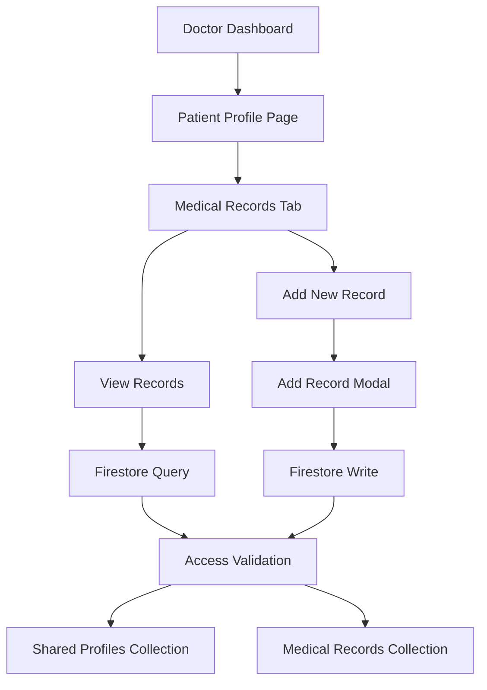

# Medical Records Functionality - Complete Overview

## Table of Contents
1. [Overview](#overview)
2. [Architecture](#architecture)
3. [Database Schema](#database-schema)
4. [Backend Functions](#backend-functions)
5. [Frontend Implementation](#frontend-implementation)
6. [Security & Access Control](#security--access-control)
7. [User Flow](#user-flow)
8. [API Reference](#api-reference)
9. [Data Validation](#data-validation)
10. [Error Handling](#error-handling)
11. [Future Enhancements](#future-enhancements)

---

## Overview

The Medical Records functionality allows authorized doctors to view, add, and manage medical records for patients who have shared their profiles. This system ensures secure, HIPAA-compliant access to patient medical data with proper authorization controls.

### Key Features
- ✅ **Secure Access Control**: Only authorized doctors can view/add records
- ✅ **Real-time Data**: Records are immediately visible after creation
- ✅ **Comprehensive Records**: Includes symptoms, diagnosis, medicines, tests, and notes
- ✅ **Pagination Support**: Handles large datasets efficiently
- ✅ **Audit Trail**: Tracks who created/modified records and when
- ✅ **Time-based Restrictions**: Records can only be edited within 30 minutes of creation

---

## Architecture



### File Structure
```
src/
├── pages/Doctor/
│   └── PatientProfilePage.jsx          # Main UI component
├── utils/
│   ├── firestoreDoctorService.js       # Doctor-specific Firestore operations
│   └── firestoreService.js             # General Firestore operations
└── components/
    ├── MedicalRecordCard.jsx           # Individual record display
    └── AddMedicalRecordModal.jsx       # Add record form
```

---

## Database Schema

### Medical Records Collection (`medicalRecords`)

```javascript
{
  id: "auto-generated-id",
  
  // Patient & Doctor Information
  patientId: "firebase-user-id",          // FK to users collection
  doctorId: "firebase-user-id",           // FK to users collection
  doctorIdCode: "DR-XXXX-1234",          // Human-readable doctor ID
  doctorName: "Dr. John Smith",           // Doctor's display name
  
  // Medical Data
  visitDate: "2025-08-20",               // YYYY-MM-DD format
  diagnosis: "Common Cold",               // Primary diagnosis
  symptoms: ["Fever", "Cough", "Headache"], // Array of symptoms
  medicines: ["Paracetamol 500mg", "Cough Syrup"], // Array of medicines
  prescribedTests: ["Blood Test", "X-Ray"], // Array of prescribed tests
  followUpNotes: "Rest for 3 days and return if symptoms persist",
  
  // File Attachments (Optional)
  fileName: "prescription.pdf",           // Original filename
  fileType: "pdf",                       // File type/extension
  fileUrl: "https://storage.url/file",    // Storage URL
  
  // Metadata
  createdAt: Timestamp,                  // Server timestamp
  lastModifiedAt: Timestamp,             // Last update timestamp
  createdBy: "firebase-user-id",         // Doctor who created the record
  shareRecordId: "doctorId_patientId",   // FK to shared_profiles
  isActive: true                         // Soft delete flag
}
```

### Shared Profiles Collection (`shared_profiles`)

```javascript
{
  id: "doctorId_patientId",              // Composite key
  patientId: "firebase-user-id",
  doctorId: "firebase-user-id",
  doctorIdCode: "DR-XXXX-1234",
  doctorName: "Dr. John Smith",
  sharedAt: Timestamp,
  status: "active"                       // active, revoked, expired
}
```

---

## Backend Functions

### 1. Add Medical Record
**Function**: `addMedicalRecord(doctorId, patientId, medicalData)`

```javascript
// Example Usage
const result = await addMedicalRecord(
  "doctor-firebase-uid",
  "patient-firebase-uid",
  {
    visitDate: "2025-08-20",
    diagnosis: "Common Cold",
    symptoms: ["Fever", "Cough"],
    medicines: ["Paracetamol 500mg"],
    prescribedTests: ["Blood Test"],
    followUpNotes: "Rest and hydration"
  }
);
```

**Access Control**:
- ✅ Verifies doctor has active access to patient's profile
- ✅ Validates shared profile exists and is active
- ✅ Records creator information for audit trail

### 2. Get Medical Records
**Function**: `getDoctorPatientMedicalRecords(doctorId, patientId, lastDoc, pageSize)`

```javascript
// Example Usage
const result = await getDoctorPatientMedicalRecords(
  "doctor-firebase-uid",
  "patient-firebase-uid",
  null,      // lastDoc for pagination
  20         // pageSize
);

// Returns
{
  success: true,
  data: [...records],
  pagination: {
    hasMore: false,
    currentPageSize: 5,
    requestedPageSize: 20
  }
}
```

### 3. Update Medical Record
**Function**: `updateMedicalRecord(recordId, doctorId, updateData)`

**Restrictions**:
- ⏰ Can only be updated within 30 minutes of creation
- 👤 Only the doctor who created it can update it
- 🔒 Must have active access to patient

### 4. Deactivate Medical Record
**Function**: `deactivateMedicalRecord(recordId, doctorId)`

**Soft Delete**: Records are marked as `isActive: false` instead of being deleted.

---

## Frontend Implementation

### Patient Profile Page Structure

```jsx
// Main Component Structure
function PatientProfilePage() {
  // State Management
  const [medicalRecords, setMedicalRecords] = useState([]);
  const [medicalRecordsLoading, setMedicalRecordsLoading] = useState(false);
  const [showAddRecordModal, setShowAddRecordModal] = useState(false);
  
  // Tab switching between Profile and Medical Records
  const [activeTab, setActiveTab] = useState('profile');
  
  // Fetch records when tab becomes active
  useEffect(() => {
    if (shareRecord && activeTab === 'medical-records') {
      fetchMedicalRecords();
    }
  }, [shareRecord, activeTab]);
}
```

### Medical Record Card Component

```jsx
const MedicalRecordCard = ({ record }) => (
  <div className="medical-record-card">
    {/* Header: Diagnosis, Doctor, Date */}
    <div className="header">
      <h4>{record.diagnosis || 'Medical Record'}</h4>
      <p>{record.doctorName} • {formatDate(record.visitDate)}</p>
    </div>
    
    {/* Content: Symptoms, Medicines, Tests, Notes */}
    <div className="content-grid">
      <TagList items={record.symptoms} colorClass="symptoms" />
      <TagList items={record.medicines} colorClass="medicines" />
      <TagList items={record.prescribedTests} colorClass="tests" />
      <div className="follow-up-notes">{record.followUpNotes}</div>
    </div>
    
    {/* File Attachments */}
    {record.fileName && (
      <div className="file-actions">
        <button>View</button>
        <button>Download</button>
      </div>
    )}
  </div>
);
```

### Add Medical Record Modal

```jsx
const AddMedicalRecordModal = () => {
  const [formData, setFormData] = useState({
    visitDate: new Date().toISOString().split('T')[0],
    diagnosis: '',
    symptoms: '',      // Comma-separated input
    medicines: '',     // Comma-separated input
    prescribedTests: '', // Comma-separated input
    followUpNotes: ''
  });
  
  const handleSubmit = (e) => {
    e.preventDefault();
    
    // Convert comma-separated strings to arrays
    const processedData = {
      ...formData,
      symptoms: formData.symptoms.split(',').map(s => s.trim()).filter(s => s),
      medicines: formData.medicines.split(',').map(m => m.trim()).filter(m => m),
      prescribedTests: formData.prescribedTests.split(',').map(t => t.trim()).filter(t => t)
    };
    
    handleAddMedicalRecord(processedData);
  };
}
```

---

## Security & Access Control

### Multi-Layer Security

1. **Authentication**: Firebase Auth ensures only logged-in users
2. **Authorization**: Firestore rules validate doctor access
3. **Share Validation**: Double-check shared profile exists and is active
4. **Audit Trail**: Track who created/modified what and when
5. **Time Restrictions**: Prevent modifications after 30 minutes

### Firestore Security Rules

```javascript
// Medical Records Collection Rules
match /medicalRecords/{recordId} {
  // Read: Only authorized doctors can read
  allow read: if isAuthorizedDoctor(resource.data.patientId);
  
  // Create: Only authorized doctors can create
  allow create: if isAuthorizedDoctor(request.resource.data.patientId)
                && request.resource.data.createdBy == request.auth.uid;
  
  // Update: Only creator within 30 minutes
  allow update: if resource.data.createdBy == request.auth.uid
                && isWithin30Minutes(resource.data.createdAt);
  
  // Delete: Only creator
  allow delete: if resource.data.createdBy == request.auth.uid;
}

function isAuthorizedDoctor(patientId) {
  let shareId = request.auth.uid + '_' + patientId;
  return exists(/databases/$(database)/documents/shared_profiles/$(shareId))
         && get(/databases/$(database)/documents/shared_profiles/$(shareId)).data.status == 'active';
}
```

---

## User Flow

### Doctor Adding a Medical Record

1. **Access Patient Profile**
   - Doctor navigates to shared patient profile
   - System validates doctor has access permission

2. **View Medical Records Tab**
   - Click on "Medical Records" tab
   - System fetches existing records for the patient

3. **Add New Record**
   - Click "Add Medical Record" button
   - Modal form opens with pre-filled current date

4. **Fill Form Data**
   - Enter diagnosis (required)
   - Add symptoms (comma-separated)
   - List medicines prescribed
   - Note any tests prescribed
   - Add follow-up instructions

5. **Submit Record**
   - Form validates required fields
   - System creates record in Firestore
   - Modal closes and records list refreshes

### Patient Record Viewing

1. **Doctor accesses patient profile via share link**
2. **System validates:**
   - Share link is valid
   - Doctor is authorized
   - Share status is 'active'
3. **Medical records are displayed:**
   - Sorted by date (newest first)
   - Paginated for performance
   - Color-coded by category

---

## API Reference

### Core Functions

#### `addMedicalRecord(doctorId, patientId, medicalData)`
**Purpose**: Creates a new medical record
**Parameters**:
- `doctorId` (string): Firebase UID of the doctor
- `patientId` (string): Firebase UID of the patient
- `medicalData` (object): Medical record data

**Returns**:
```javascript
{
  success: boolean,
  recordId?: string,
  message?: string,
  error?: string
}
```

#### `getDoctorPatientMedicalRecords(doctorId, patientId, lastDoc?, pageSize?)`
**Purpose**: Retrieves medical records for a patient
**Parameters**:
- `doctorId` (string): Firebase UID of the doctor
- `patientId` (string): Firebase UID of the patient
- `lastDoc` (DocumentSnapshot, optional): For pagination
- `pageSize` (number, optional): Records per page (default: 20)

**Returns**:
```javascript
{
  success: boolean,
  data?: Array<MedicalRecord>,
  pagination?: {
    hasMore: boolean,
    currentPageSize: number,
    requestedPageSize: number
  },
  error?: string
}
```

#### `updateMedicalRecord(recordId, doctorId, updateData)`
**Purpose**: Updates an existing medical record
**Restrictions**: Only within 30 minutes, only by creator

#### `deactivateMedicalRecord(recordId, doctorId)`
**Purpose**: Soft deletes a medical record

---

## Data Validation

### Frontend Validation
- **Required Fields**: Diagnosis, Visit Date
- **Format Validation**: Date format (YYYY-MM-DD)
- **Array Processing**: Convert comma-separated strings to arrays
- **Trim Whitespace**: Clean up user inputs

### Backend Validation
- **Access Control**: Verify doctor has permission
- **Data Integrity**: Ensure required fields are present
- **Time Restrictions**: Validate update timing
- **Creator Verification**: Confirm record ownership

---

## Error Handling

### Common Error Scenarios

1. **Access Denied**
   ```javascript
   {
     success: false,
     error: "You don't have access to this patient's profile."
   }
   ```

2. **Update Timeout**
   ```javascript
   {
     success: false,
     error: "Medical record cannot be updated after 30 minutes of creation."
   }
   ```

3. **Network Errors**
   ```javascript
   {
     success: false,
     error: "Failed to fetch medical records."
   }
   ```

### Error Handling Strategy
- **User-Friendly Messages**: Clear, actionable error descriptions
- **Retry Mechanisms**: Allow users to retry failed operations
- **Fallback States**: Graceful degradation when data is unavailable
- **Loading States**: Visual feedback during operations

---

## Future Enhancements

### Planned Features
1. **📎 File Attachments**: Upload prescriptions, test results, images
2. **🔍 Advanced Search**: Filter by diagnosis, date range, doctor
3. **📊 Analytics**: Medical history trends and insights
4. **🔔 Notifications**: Alert patients about new records
5. **📱 Mobile Optimization**: Responsive design for mobile devices
6. **🌐 Offline Support**: PWA capabilities for offline access
7. **🔐 Enhanced Security**: End-to-end encryption for sensitive data
8. **📋 Templates**: Pre-defined templates for common conditions
9. **🎯 Smart Suggestions**: AI-powered diagnosis and treatment suggestions
10. **📈 Integration**: Connect with external medical systems and devices

### Technical Improvements
- **Real-time Updates**: WebSocket connections for live updates
- **Advanced Pagination**: Cursor-based pagination for better performance
- **Caching Strategy**: Implement Redis for frequently accessed data
- **Backup System**: Automated backups for critical medical data
- **API Rate Limiting**: Protect against abuse and ensure fair usage

---

## Conclusion

The Medical Records functionality provides a secure, user-friendly system for doctors to manage patient medical records. With robust access controls, comprehensive data validation, and a clean user interface, it ensures both security and usability in medical data management.

The system is designed to be:
- **Secure**: Multi-layer security with audit trails
- **Scalable**: Efficient queries and pagination
- **User-Friendly**: Intuitive interface for doctors
- **Compliant**: Designed with healthcare regulations in mind
- **Maintainable**: Clean code architecture and documentation

This implementation serves as a solid foundation for a comprehensive medical records management system that can be extended with additional features as needed.
